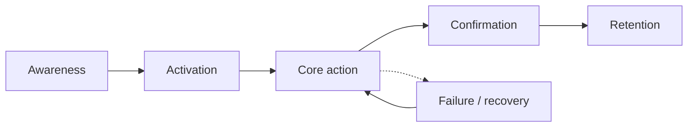
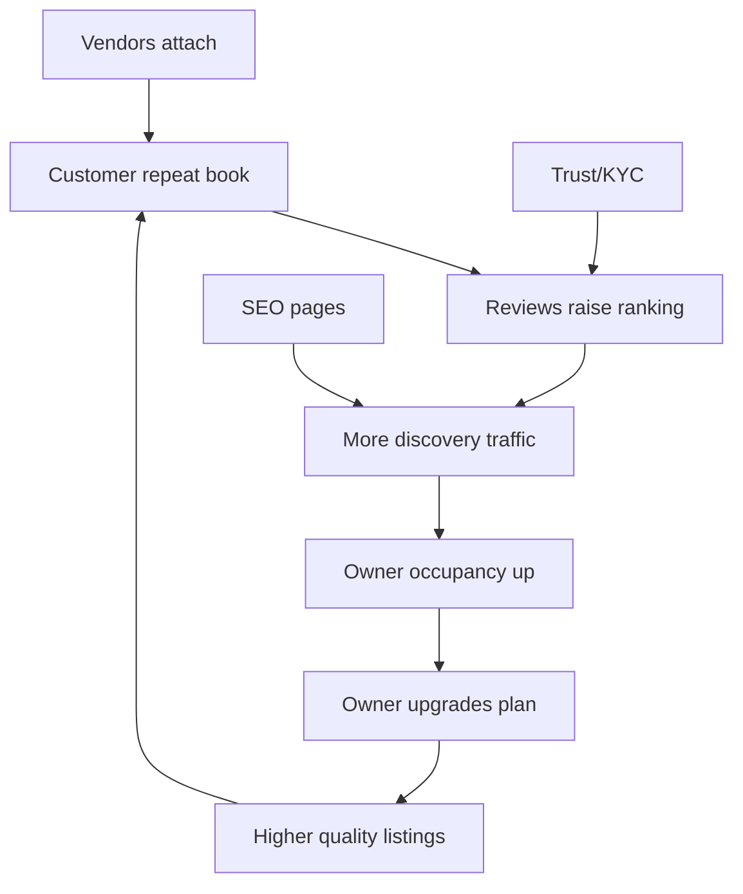

# 02 — Journey Maps

**Document ID:** PRD-02  
**Related:** [01-personas.md](01-personas.md), [10-wireframes-ux.md](10-wireframes-ux.md)

Each persona includes a **happy path** and **failure path**, from first visit through retention loops.

---

## 1. Journey legend

| Stage | Meaning |
|-------|---------|
| Awareness | First touch (SEO, ads, referral, sales) |
| Activation | Account + first meaningful setup |
| Core action | Book / publish / resolve / sell |
| Confirmation | Trust signal (payment, notify, badge) |
| Retention | Repeat use, upgrade, referral |
| Failure | Error, conflict, distrust — with recovery |

---

## 2. P1 Customer journeys

### 2.1 Happy path — wedding hall booking

| Stage | Steps | Emotions | Touchpoints |
|-------|-------|----------|-------------|
| Awareness | Google “banquet hall Jaipur 500 pax” → SSR city/category page | Hopeful | Website SEO |
| Activation | Deep-link to app / continue web → register/login | Slight friction | Auth |
| Core | Filter date+capacity → venue detail → calendar → hold | Focused | Search, detail, booking |
| Confirm | Razorpay UPI success → booking CONFIRMED → push/email/WhatsApp | Relief | Payments, notify |
| Retention | Add to wishlist siblings’ dates; leave review; rebook anniversary | Loyalty | Reviews, wishlist |

### 2.2 Failure path — slot taken during pay

| Stage | Steps | Recovery |
|-------|-------|----------|
| Core | Hold acquired; user delays on payment | Hold TTL countdown visible |
| Failure | Hold expires OR concurrent confirm wins | Clear “slot no longer available” |
| Recovery | Suggest next 3 open slots; one-tap re-hold | Search/booking |
| Support | If money captured without booking | Auto-reconcile + support ticket escalation |

**Retention risk:** Unclear failures → churn. Mitigation: explicit states, idempotent pay, support timeline.

---

## 3. P2 Hall Owner journeys

### 3.1 Happy path — first listing to first paid booking

| Stage | Steps |
|-------|-------|
| Awareness | Sales outreach / peer referral |
| Activation | Register → create Organization → KYC start → create venue draft |
| Core | Upload photos → set inventory unit → availability → pricing → publish request |
| Confirm | Listing verified / published → first booking notification → accept/instant |
| Retention | Calendar OS daily use; upgrade to Professional for multi-staff + reports |

### 3.2 Failure path — double promise offline

| Failure | Owner blocked slot late; customer already held |
|--------|--------------------------------------------------|
| System | Hold blocks owner overlapping block OR shows conflict |
| Recovery | Owner contacts customer via support policy; cancel/refund rules apply |
| Learning | Sales educates “calendar is source of truth” |

---

## 4. P3 Training Institute Owner journeys

### 4.1 Happy path — recurring batch slots

1. Create rooms as inventory units  
2. Define weekly recurring availability  
3. Publish packages (4-session / 8-session)  
4. Students book prepaid trial → convert to package  
5. Owner views utilization report; opens more evening slots  

### 4.2 Failure path — trainer leave / room maintenance

1. Owner blocks dates → existing bookings flagged  
2. Notify affected customers; offer reschedule windows  
3. Refund or credit per BR cancellation table  
4. Preference: proactive WhatsApp template within SLA  

---

## 5. P4 Sports Ground Owner journeys

### 5.1 Happy path — evening peak slots

1. Configure pitch hourly grid + peak pricing  
2. Players discover via map radius + “available tonight”  
3. Instant book + UPI → gate check-in with booking ID  
4. Add-on lights sold at checkout  
5. Repeat weekly booking by same user  

### 5.2 Failure path — rain cancellation

1. Owner marks weather cancel for evening block  
2. System initiates policy refund / credit  
3. Players notified; optional rebook next day discount coupon  
4. Support monitors spike in weather tickets  

---

## 6. P5 Vendor journeys

### 6.1 Happy path — attached décor package

1. Vendor onboards profile + portfolio  
2. Customer booking banquet sees recommended vendors  
3. Vendor sends quote → customer accepts → advance pay  
4. Job completed → review → payout  

### 6.2 Failure path — date conflict

1. Vendor overbooked manually  
2. Cannot accept overlapping job; must decline or propose alternate crew  
3. Customer offered next vendor recommendations  
4. Vendor rating impacted if late cancel beyond grace  

---

## 7. P6 Administrator journeys

### 7.1 Happy path — verify listing

1. Queue shows org KYC complete + venue publish request  
2. Admin checks photos, address, capacity claims  
3. Approve verification badge / publish  
4. Audit log records actor + reason  

### 7.2 Failure path — stolen photos detected

1. Flag from user report or hash match (later)  
2. Force unpublish + notify owner  
3. Freeze payouts if fraud severity high  
4. Case tracked to resolution; repeat offender ban  

---

## 8. P7 Support journeys

### 8.1 Happy path — refund within policy

1. Ticket: “cancelled 10 days before event”  
2. Lookup booking timeline + payment capture  
3. Apply BR refund % → initiate refund → customer notified  
4. Ticket closed with CSAT  

### 8.2 Failure path — webhook delay / user charged twice

1. Customer shows bank debit; app shows pending  
2. Support sees payment intents + reconciliation status  
3. Trigger reconcile / wait for webhook / manual confirm per runbook  
4. Escalate to finance if ledger mismatch persists  

---

## 9. P8 Sales journeys

### 9.1 Happy path — city supply blitz

1. Lead imported / created for target pincode cluster  
2. Demo → org created → activation checklist  
3. First venue published → first booking coached  
4. Upsell Professional at day 30  

### 9.2 Failure path — ghosted lead

1. No login in 7 days after demo  
2. Automated nudge + sales task  
3. If still inactive → recycle lead; mark reason  
4. Product feedback if onboarding friction tagged repeatedly  

---

## 10. Cross-persona retention loops

**First visit → retention summary**

| Persona | First-visit win | Retention hook |
|---------|-----------------|----------------|
| Customer | Successful confirmed booking | Wishlist, reviews, faster rebook |
| Hall Owner | First paid booking without phone chaos | Calendar habit + payouts |
| Training Owner | Filled batch without calls | Recurring slots + packages |
| Sports Owner | Peak evening sold online | Yield pricing + repeat players |
| Vendor | First won attached job | Ratings + inbound RFQs |
| Admin | Clean verification queue | Lower fraud ratio |
| Support | First ticket resolved in-policy | Macro speed + CSAT |
| Sales | Activated org | Plan conversion commission |

---

## 11. Journey → FR mapping (high level)

| Journey moment | Primary FR modules |
|----------------|--------------------|
| Discover | Search, Maps, Website SEO |
| Hold/Book/Pay | Booking, Payments, Calendar |
| Notify | Notifications |
| Trust | Reviews, Trust & Safety, Admin |
| Money clarity | Invoices, Refunds, Settlements |
| Growth | Coupons, CMS, Subscriptions, Sales CRM |
