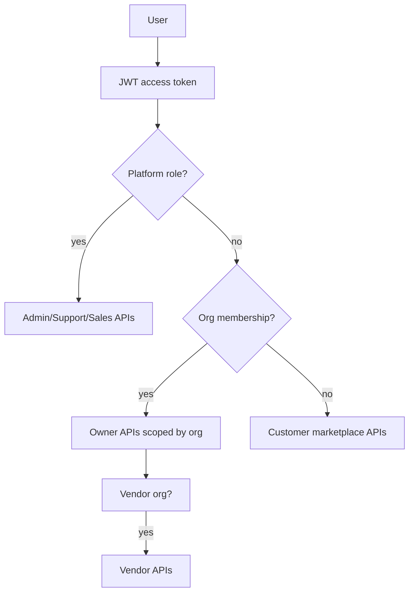

# 06 — Roles & Permissions (RBAC)

**Document ID:** PRD-06  
**Related:** [03-multi-tenancy.md](../architecture/03-multi-tenancy.md), ADR-004  
**Principle:** Authenticate globally; authorize with platform roles **or** org membership roles. Never trust client org id alone.

---

## 1. Role model

### 1.1 Platform roles (BookMySpace internal)

| Role ID | Product name | Description |
|---------|--------------|-------------|
| `PLATFORM_SUPER_ADMIN` | Super Admin | Full platform control; break-glass |
| `PLATFORM_ADMIN` | Administrator | Config, taxonomy, flags, verification ops |
| `PLATFORM_MODERATOR` | Moderator | Listing/review moderation |
| `PLATFORM_SUPPORT` | Support Executive | Tickets, lookups, in-policy refunds |
| `PLATFORM_SALES` | Sales Executive | Leads, onboarding CRM, no arbitrary PII fishing |
| `PLATFORM_FINANCE` | Finance (optional later) | Settlements, reconcile |

### 1.2 Organization roles (venue businesses)

| Role ID | Product name | Description |
|---------|--------------|-------------|
| `ORG_OWNER` | Venue Owner | Full org control; billing; payouts |
| `ORG_MANAGER` | Venue Manager | Venues, calendar, bookings; limited billing |
| `ORG_STAFF` | Venue Staff | Calendar ops, check-in, limited edits |
| `ORG_ACCOUNTANT` | Accountant | Read financials, invoices, exports |

### 1.3 Marketplace & partner roles

| Role ID | Product name | Description |
|---------|--------------|-------------|
| `CUSTOMER` | Customer | Authenticated booker (no org required) |
| `VENDOR_OWNER` | Vendor | Manages vendor org/profile |
| `VENDOR_STAFF` | Vendor Staff | Fulfills jobs |
| `EVENT_ORGANIZER` | Event Organizer | Multi-booking workspaces (V2+) |
| `FRANCHISE_PARTNER` | Franchise Partner | Multi-org rollup (Enterprise) |

> Product names in the brief (Customer, Venue Owner, Venue Staff, Vendor, Event Organizer, Admin, Super Admin, Franchise Partner, Sales Executive, Support Executive) map to the IDs above.

---

## 2. Permission catalog (representative)

Permissions are strings checked in application layer.

| Permission | Meaning |
|------------|---------|
| `identity:self:write` | Edit own profile |
| `org:create` | Create organization |
| `org:read` | Read org profile |
| `org:write` | Edit org profile |
| `org:members:write` | Invite/remove members |
| `org:billing:write` | Subscription & payout profile |
| `venue:read` | Read org venues |
| `venue:write` | Create/edit venues |
| `venue:publish` | Submit/publish |
| `media:write` | Upload media |
| `calendar:write` | Blocks & availability |
| `booking:read` | Read org bookings |
| `booking:write` | Manual bookings / accept-reject |
| `booking:cancel` | Cancel org-side |
| `pricing:write` | Pricing rules |
| `coupon:write` | Owner coupons |
| `report:read` | Owner reports |
| `crm:write` | Owner CRM notes |
| `payout:read` | Earnings |
| `invoice:read` | Invoices |
| `marketplace:book` | Customer hold/book |
| `marketplace:review` | Submit review |
| `wishlist:write` | Wishlist |
| `vendor:profile:write` | Vendor profile |
| `vendor:quote:write` | Send quotes |
| `admin:lookup` | Cross-org lookup |
| `admin:moderate` | Unpublish/moderate |
| `admin:verify` | KYC/listing verify |
| `admin:flags` | Feature flags |
| `admin:refund` | Support refund |
| `admin:audit:read` | Audit viewer |
| `sales:leads` | Sales CRM |
| `support:tickets` | Ticket console |
| `franchise:rollup` | Multi-org dashboards |
| `event:workspace` | Organizer tools |

---

## 3. Full RBAC matrix

Legend: **F** = full, **L** = limited/scoped, **R** = read, **—** = none, **S** = self only

### 3.1 Customer & owner org

| Permission / capability | Customer | ORG_OWNER | ORG_MANAGER | ORG_STAFF | ORG_ACCOUNTANT |
|-------------------------|----------|-----------|-------------|-----------|----------------|
| Register/login | F | F | F | F | F |
| Edit own profile | S | S | S | S | S |
| Create org | F | — (already) | — | — | — |
| Manage org profile | — | F | L | — | R |
| Members invite/remove | — | F | L | — | — |
| Billing / subscription | — | F | — | — | R |
| Venue CRUD | — | F | F | L (edit limited) | — |
| Publish venue | — | F | F | — | — |
| Media upload | — | F | F | L | — |
| Calendar / blocks | — | F | F | F | — |
| Accept/reject requests | — | F | F | L | — |
| Manual booking | — | F | F | F | — |
| Cancel booking (org) | — | F | F | L | — |
| Pricing rules | — | F | F | — | R |
| Owner coupons | — | F | F | — | — |
| Reports/export | — | F | F | — | F |
| CRM notes | — | F | F | L | — |
| Payouts read | — | F | L | — | F |
| Invoices read | — | F | L | — | F |
| Marketplace search/book | F | F* | F* | F* | F* |
| Review after completed | F | — | — | — | — |
| Wishlist | F | — | — | — | — |
| Support ticket create | F | F | F | F | F |

\*Owner users may also act as customers with same user identity when booking other orgs’ venues.

### 3.2 Vendor & partners

| Permission / capability | VENDOR_OWNER | VENDOR_STAFF | EVENT_ORGANIZER | FRANCHISE_PARTNER |
|-------------------------|--------------|--------------|-----------------|-------------------|
| Vendor profile | F | R | — | — |
| Quotes / jobs | F | L | — | — |
| Vendor calendar | F | F | — | — |
| Vendor payouts | F | — | — | R (rollup if linked) |
| Event workspace | — | — | F | L |
| Multi-booking shortlist | — | — | F | F |
| Multi-org rollup | — | — | — | F |
| White-label config | — | — | — | L (if entitled) |

### 3.3 Platform internal

| Permission / capability | SUPPORT | SALES | MODERATOR | ADMIN | SUPER_ADMIN | FINANCE |
|-------------------------|---------|-------|-----------|-------|-------------|---------|
| Lookup user/org/venue/booking | F | L (leads/orgs) | F | F | F | F |
| Tickets | F | L | L | F | F | L |
| In-policy refund | F | — | — | F | F | F |
| Force unpublish | — | — | F | F | F | — |
| KYC / verify listing | — | L (submit assist) | F | F | F | — |
| Feature flags / taxonomy | — | — | — | F | F | — |
| Audit log read | L | — | L | F | F | F |
| Sales leads CRM | — | F | — | F | F | — |
| Settlement tools | — | — | — | L | F | F |
| Impersonate user | — | — | — | — | Forbidden by default | — |
| Delete platform data | — | — | — | L | F | L |

---

## 4. Mapping brief roles → system roles

| Brief role | System role ID(s) |
|------------|-------------------|
| Customer | `CUSTOMER` |
| Venue Owner | `ORG_OWNER` |
| Venue Staff | `ORG_STAFF` (+ Manager as elevated staff) |
| Vendor | `VENDOR_OWNER` / `VENDOR_STAFF` |
| Event Organizer | `EVENT_ORGANIZER` |
| Admin | `PLATFORM_ADMIN` / `PLATFORM_MODERATOR` |
| Super Admin | `PLATFORM_SUPER_ADMIN` |
| Franchise Partner | `FRANCHISE_PARTNER` |
| Sales Executive | `PLATFORM_SALES` |
| Support Executive | `PLATFORM_SUPPORT` |

---

## 5. AuthZ rules (normative)

1. Access token carries `sub`, platform roles, token version; org memberships resolved server-side (embedded claims optional for active org).
2. Owner APIs require membership permission check + `organization_id` filter on every query.
3. Admin APIs require platform role; all mutations audited.
4. Marketplace write APIs require `CUSTOMER` (authenticated); guest deferred.
5. Resource ownership: booking cancel by customer only if `booking.customer_user_id == sub`.
6. Support lookup may use phone **hash**, not raw phone display where possible.

---

## 6. Mermaid — authorization context

