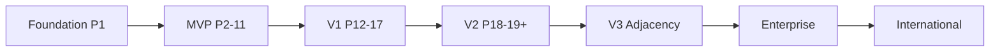

# 11 — Risks, Roadmap, Metrics & Open Questions

**Document ID:** PRD-11  
**Related:** [phase-roadmap.md](../roadmap/phase-roadmap.md), [00-vision-review.md](../architecture/00-vision-review.md)

---

## 1. Product risks & mitigations

| ID | Risk | Impact | Likelihood | Mitigation |
|----|------|--------|------------|------------|
| R-01 | Double booking | Trust collapse | M | BR-BOOK-04 layers; concurrency tests; US-085 gate |
| R-02 | Payment/refund inconsistency | Financial loss | M | ADR-010; reconcile job; webhook truth |
| R-03 | Fake listings | Marketplace death | H early | KYC + verification + force unpublish early |
| R-04 | Category sprawl | Unmaintainable UX/rules | H | Capability plugins; flag rollouts |
| R-05 | WhatsApp cost blowup | Unit economics | M | Templates, prefs, budget guards |
| R-06 | Weak SEO if Flutter-only | Slow growth | H without SSR | ADR-002 website |
| R-07 | Tenant data leak | Existential | L/M | Tenancy tests; never trust client org id |
| R-08 | Premature microservices/Kafka/OpenSearch | Velocity loss | M | ADRs 001/006/007; product doesn’t force extract |
| R-09 | Owner churn from payout opacity | Supply loss | M | Earnings ledger + settlement UX V1 |
| R-10 | Support overload at launch | CSAT drop | M | Macros, timelines, in-policy auto-refund |
| R-11 | DPDP non-compliance | Legal | M | Consent, export/erase, retention |
| R-12 | Overbuilding admin/AI/vendor pre-liquidity | Waste | H | Backlog MoSCoW; AI assistive only |
| R-13 | Commission + fee stacking anger | Conversion drop | M | Transparent breakdown; avoid junk fees |
| R-14 | Partial-pay / pay-at-venue fraud | Loss | M | Feature flags; deposits; later enable |

---

## 2. Release roadmap (product) ↔ eng phases

Product releases are **commercial milestones**. Engineering phases 1–20 remain the delivery spine — do not contradict them.

| Product release | Goal | Maps to eng phases (approx) | Exit themes |
|-----------------|------|-----------------------------|-------------|
| **Foundation** | Tooling + shells | Phase 1 (done per implementation report caveats) | Monorepo, API shell, Flutter shells |
| **MVP** | One category cluster bookable end-to-end in 1–2 cities | Phases 2–11 (+ critical 12 bits) | Auth, org, venue, media, hold, book, pay, notify, search |
| **V1** | Owner OS daily-driver + trust + SEO + admin | Phases 12–17 | Calendar OS, reviews, admin, SSR, WhatsApp, settlements/GST |
| **V2** | Category expansion + monetization depth | Phases 18–19 + product modules CRM/coupons/vendor start | Sports/training/coworking plugins; ranking; subscriptions mature |
| **V3** | Marketplace adjacency + growth machine | Post-20 product | Vendor marketplace, richer CRM, experiments |
| **Enterprise** | Multi-org, white-label, API, franchise | After PMF + contracts | FR-EVT-*, SSO later |
| **International** | New countries | After India PMF | Local payments/tax — new ADRs |

### MVP scope (must)

- Banquet/meeting/community venues  
- Auth-first customers  
- Hold → pay (Razorpay/UPI) → confirm  
- Owner org + draft/publish + calendar blocks  
- Push+email notify  
- Postgres FTS search  
- Basic admin lookup + unpublish  

### Explicitly not MVP

- Vendor marketplace, AI narratives, franchise, white-label, guest checkout, OpenSearch, Kafka, vernacular UI, pay-at-venue default

---

## 3. Success metrics / KPIs

### 3.1 North-star

**Confirmed bookings per week** in launch cities (leading indicator of liquidity).

### 3.2 Marketplace funnel

| KPI | Definition | MVP target (indicative) |
|-----|------------|-------------------------|
| Search→Detail CTR | Clicks / searches | Track baseline |
| Detail→Hold | Holds / detail views | Track |
| Hold→Pay start | Pay starts / holds | ≥ 60% |
| Pay→Confirm | Confirmed / pay starts | ≥ 85% |
| Detail→Confirm | End-to-end | ≥ 8% early; improve |

### 3.3 Supply

| KPI | Target mindset |
|-----|----------------|
| Time-to-first-publish | ↓ week over week |
| Publish rate of signed orgs | ≥ 40% in 14 days |
| % verified listings | ↑ |
| Owner WAU / published org | Habit on calendar |

### 3.4 Quality / trust

| KPI | Target |
|-----|--------|
| Silent double-booking incidents | **0** |
| Payment reconcile breaks | 0 critical open > 24h |
| Cross-tenant test failures | 0 on main |
| Fraud force-unpublishes | Track; false positive rate |

### 3.5 Money

| KPI | Notes |
|-----|-------|
| GMV | Gross booking value INR |
| Net revenue | Sub + commission + featured − refunds/fees |
| Take rate effective | Net marketplace / GMV |
| WhatsApp cost / confirmed booking | Guardrail |

### 3.6 Product quality

| KPI | Target |
|-----|--------|
| API p95 | Per NFR |
| Crash-free sessions | ≥ 99.5% |
| CSAT support | Track V1 |
| NPS customer/owner | Track V1/V2 |

---

## 4. Assumptions

1. Phase 1 foundation exists (monorepo, API shell, Flutter shells, Compose Postgres/Redis, CI) — see [phase-1-implementation-report.md](../architecture/phase-1-implementation-report.md). PRD is not an implementation report.  
2. Auth-first MVP; guest checkout deferred.  
3. Razorpay sole India PSP initially.  
4. EN UI first; HI later.  
5. Subscription prices/commission % placeholders until founder approval.  
6. Modular monolith + outbox + FTS remain until ADR change.  
7. AI never blocks booking path.

---

## 5. Open questions (founder / stakeholder decisions ASAP)

| ID | Question | Why blocking | Owner |
|----|----------|--------------|-------|
| OQ-01 | Final Starter/Professional list prices + annual discount? | Billing + sales decks | Founders |
| OQ-02 | Commission % by category + who bears Razorpay fees on refunds? | Ledger + BR-REF | Founders + Finance |
| OQ-03 | Customer convenience fee allowed? | Trust + UX | Founders + PM |
| OQ-04 | Soft-launch unverified publish vs hard KYC gate? | Supply velocity vs trust | Founders + Trust |
| OQ-05 | Launch cities + first category cluster confirmation? | Sales + SEO + flags | Founders + Growth |
| OQ-06 | Request-to-book default vs instant for halls? | Conversion vs owner control | PM + Supply |
| OQ-07 | Partial payment threshold for CONFIRMED? | Booking state semantics | PM + Finance |
| OQ-08 | GST registration posture for platform invoices? | INV module | Finance + Legal |
| OQ-09 | WhatsApp BSP vendor + monthly budget? | NOTIF cost | Ops + Finance |
| OQ-10 | SSR framework choice Next vs Astro (eng)? | Website Phase 15 | Eng (ADR-002 allows either) |
| OQ-11 | Hindi timing relative to V1? | I18n backlog | PM |
| OQ-12 | Vendor marketplace: attach-only vs standalone discovery first? | V2 scope | PM |
| OQ-13 | Enterprise white-label priority vs API? | Sales promises | Founders + Sales |
| OQ-14 | Data retention periods by class? | DPDP | Legal |
| OQ-15 | Support hours / SLA public commitments? | SUP expectations | Ops |

---

## 6. Stakeholder decision log (template)

| Date | Decision | Decider | Replaces |
|------|----------|---------|----------|
| 2026-08-02 | Hybrid marketplace + owner OS; modular monolith; India-first rails | Architecture / Foundation | — |
| _TBD_ | Pricing & commissions | Founders | OQ-01/02 |
