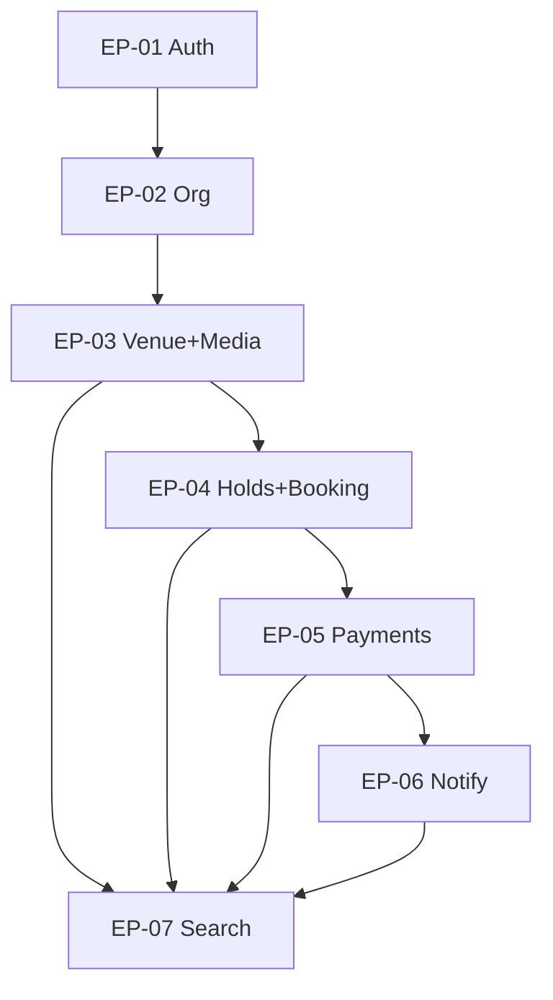

# 12 — Prioritized Product Backlog

**Document ID:** PRD-12  
**Method:** MoSCoW within release trains; stories pulled by dependency order aligned to eng Phases 2–20  
**Story source:** [`stories/`](stories/) (US-001–US-315)

---

## 1. How to use for sprint planning

1. Select the active **release train** (MVP → V1 → …).  
2. Pull **Must** epics first; never start a Should/Could that blocks Must dependencies.  
3. Slice vertical: prefer “thin end-to-end” (e.g., one venue category book path) over horizontal sprawl.  
4. Each sprint commits to `US-xxx` with all `AC-*-*` testable.  
5. Respect architecture constraints (monolith, outbox, FTS, Razorpay isolation).

### Priority legend

| Tag | Meaning |
|-----|---------|
| **M** | Must — release cannot ship without |
| **S** | Should — important, include if capacity |
| **C** | Could — stretch |
| **W** | Won’t (this release) — park |

---

## 2. Epic catalog

| Epic ID | Epic name | Primary release | Eng phases |
|---------|-----------|-----------------|------------|
| EP-01 | Identity & Access | MVP | 3–4 |
| EP-02 | Organization & Tenancy | MVP | 5 |
| EP-03 | Venue Catalog & Media | MVP | 5–6 |
| EP-04 | Availability, Holds & Booking | MVP | 7–8 |
| EP-05 | Payments & Receipts | MVP | 9 |
| EP-06 | Notifications (Push/Email) | MVP | 10 |
| EP-07 | Customer Discovery (FTS) | MVP | 11 |
| EP-08 | Owner Calendar OS | V1 | 12 |
| EP-09 | Reviews & Trust Basics | V1 | 13 |
| EP-10 | Admin Console & KYC | V1 | 14 |
| EP-11 | SEO Website | V1 | 15 |
| EP-12 | WhatsApp & Preferences | V1 | 16 |
| EP-13 | Settlements & GST Invoices | V1 | 17 |
| EP-14 | Subscriptions & Featured | V1 | — (product) |
| EP-15 | Support Desk | V1 | — |
| EP-16 | Category Expansion | V2 | 18 |
| EP-17 | Search Hardening | V2 | 19 |
| EP-18 | CRM & Sales Ops | V2 | — |
| EP-19 | Coupons & Campaigns | V2 | — |
| EP-20 | Vendor Marketplace | V3 | — |
| EP-21 | AI Assists | V3 | — |
| EP-22 | Event Organizer & Franchise | Enterprise | — |
| EP-23 | Scale Readiness | V2/Ent | 20 |
| EP-24 | International | International | post-India |

---

## 3. MVP backlog (Must first)

### EP-01 Identity & Access — M
**Features:** Register/login/refresh/logout; profile; consent; rate limits  
**Stories:** US-001–011 (M); US-012–015 (S → V1)

### EP-02 Organization & Tenancy — M
**Features:** Create org; memberships; switch context; isolation tests  
**Stories:** US-016–021, US-026 (M); US-022–025, US-027 (S)

### EP-03 Venue Catalog & Media — M
**Features:** Draft venue; units; amenities; geo; pricing base; publish validation; media upload  
**Stories:** US-028–037, US-040–043, US-045–051, US-053 (M); US-038–039, US-044, US-052 (S)

### EP-04 Availability, Holds & Booking — M
**Features:** Rules; blocks; hold TTL; concurrency; state machine; idempotent confirm; lists; audit  
**Stories:** US-077–085, US-088–089, US-091–104, US-108–110 (M); US-086–087, US-090, US-105–107 (S/C)

### EP-05 Payments & Receipts — M
**Features:** Razorpay order; webhook; mismatch guard; receipt; refund primitive; reconcile; no PAN  
**Stories:** US-111–120, US-122–125 (M); US-121 (S)

### EP-06 Notifications — M
**Features:** FCM register; push/email confirm/cancel; outbox retries; owner alert; prefs stub  
**Stories:** US-126–132 (M); US-133–137 (S → V1)

### EP-07 Customer Discovery — M
**Features:** FTS search; filters; sort; pagination; empty; projection outbox; funnel events; maps basics  
**Stories:** US-054–064, US-068–070, US-073–074, US-288–289 (M); US-065–067, US-071–072, US-075–076 (S)

### MVP Won’t
Vendor, AI, franchise, OpenSearch, Kafka, guest checkout, vernacular, full CRM, sports/coworking plugins (flagged off)

---

## 4. V1 backlog

| Epic | MoSCoW | Key stories |
|------|--------|-------------|
| EP-08 Owner Calendar OS | M | US-078–082, US-086–087, US-094–095, US-099–100 |
| EP-09 Reviews & Trust | M | US-138–141, US-146, US-280–281, US-246–247 |
| EP-10 Admin | M | US-238–243, US-246–248, US-220 |
| EP-11 SEO Website | M | US-272–278, US-228, US-236 |
| EP-12 WhatsApp & Prefs | S/M | US-130, US-133–135, US-137 |
| EP-13 Settlements & GST | M | US-164–168, US-171, US-176–180 |
| EP-14 Subscriptions | M | US-206–208, US-211–212, US-214; US-209–210, US-213, US-215–217 (S) |
| EP-15 Support | M | US-218–227 |
| Maps polish | S | US-071–072, US-075–076 |
| Wishlist | S | US-148–151, US-153 |
| Reviews extras | S | US-139, US-142–145 |

---

## 5. V2 backlog

| Epic | MoSCoW | Key stories |
|------|--------|-------------|
| EP-16 Category expansion | M | US-290–295, sports/training/coworking UX |
| EP-17 Search hardening | M | US-065, ranking NFRs; OpenSearch **decision gate only** |
| EP-18 CRM & Sales | M | US-184–193, US-306–312 |
| EP-19 Coupons | S | US-154–161, US-163 |
| Partial pay | S | US-106, US-121 |
| Reports depth | S | US-194–204 |
| CMS growth | S | US-229–235, US-237 |
| Scale readiness start | S | EP-23 / Phase 20 items |

---

## 6. V3 / Enterprise / International

| Epic | Release | Key stories |
|------|---------|-------------|
| EP-20 Vendor Marketplace | V3 | US-252–263, US-147 |
| EP-21 AI Assists | V3 | US-264–271 |
| Referrals | V3 | US-162, US-315 |
| EP-22 Event & Franchise | Enterprise | US-296–305 |
| White-label / API | Enterprise | US-302, US-305 |
| EP-24 International | International | New FR set + ADRs (payments/tax/i18n) |

---

## 7. Dependency graph (MVP critical path)

---

## 8. Suggested first 6 sprints (illustrative)

Assuming 2-week sprints post-foundation; adjust to team velocity.

| Sprint | Focus | Example stories |
|--------|-------|-----------------|
| S1 | Auth + design shells wired | US-001–005, US-008–011 |
| S2 | Org + venue draft | US-016–021, US-028–034, US-026 |
| S3 | Media + publish validation | US-046–051, US-035–037, US-040–043 |
| S4 | Availability + holds | US-077–085, US-088 |
| S5 | Booking SM + payments | US-091–096, US-111–120 |
| S6 | Notify + search + E2E | US-126–132, US-054–064, US-068, US-288 |

Exit MVP when [00-prd-overview.md](00-prd-overview.md) §9 MVP success criteria pass on staging.

---

## 9. Backlog hygiene rules

1. No story without AC.  
2. No MVP story that requires Kafka/OpenSearch/microservices.  
3. Feature flags for category and booking-mode expansion.  
4. After each release, revisit OQ decisions in [11-risks-roadmap-metrics.md](11-risks-roadmap-metrics.md).  
5. When ADR changes, update affected FR/US — don’t silently fork architecture in backlog notes.

---

## 10. Traceability cheat sheet

| If you need… | Open |
|--------------|------|
| Why we’re building | [00-prd-overview.md](00-prd-overview.md) |
| Who for | [01-personas.md](01-personas.md) |
| What system must do | [03-functional-requirements.md](03-functional-requirements.md) |
| Rules | [05-business-rules.md](05-business-rules.md) |
| Who can do what | [06-roles-permissions.md](06-roles-permissions.md) |
| Money | [07-subscription-revenue.md](07-subscription-revenue.md) |
| Build/test items | [`stories/`](stories/) |
| Screens | [10-wireframes-ux.md](10-wireframes-ux.md) |
| When / KPIs | [11-risks-roadmap-metrics.md](11-risks-roadmap-metrics.md) |
